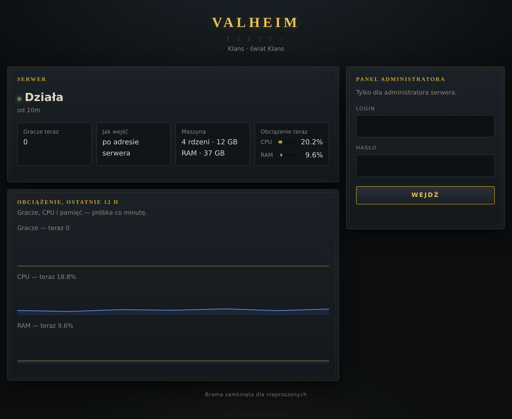
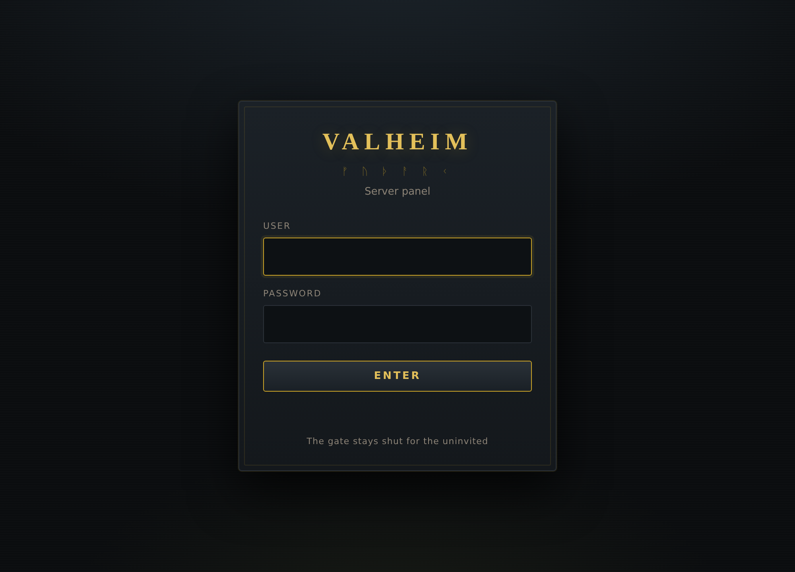
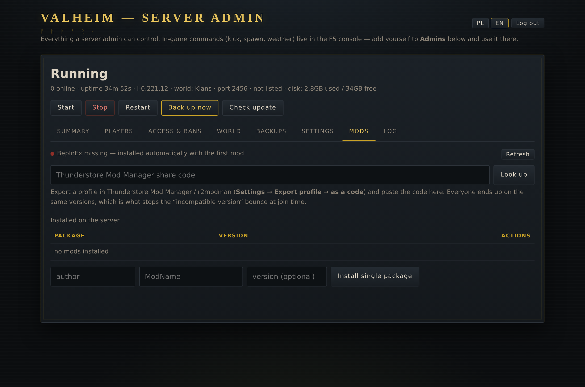
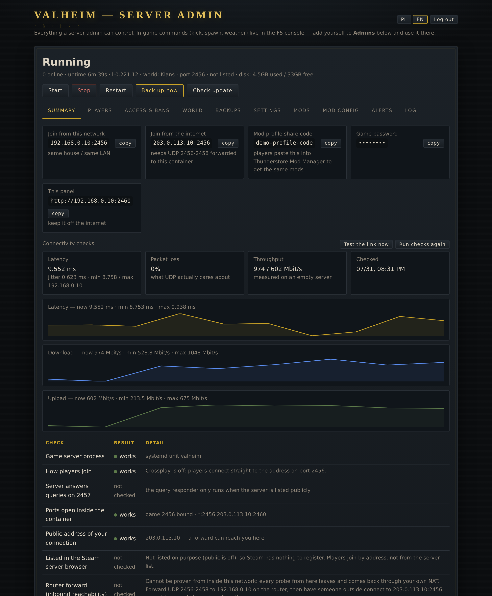
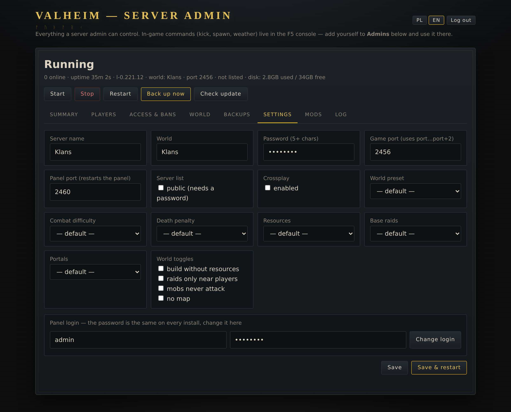

<div align="center">


# valheim-proxmox

**Valheim dedicated server in its own LXC, with a web panel to run it.**

[English](#-english) · [Polski](#-polski) · [Screenshots](#what-it-looks-like) · [Panel](#the-panel) · [Mods](#mods-from-a-share-code)

</div>

---

## Install

Two ways in, depending on what you are installing onto. Both end with the same thing:
the game server, the panel, backup and update timers.

### On a Proxmox VE host — creates the container for you

Run as root **on the Proxmox host**. It builds an unprivileged Debian LXC, installs
everything into it and prints the address, the login and the game password.

```bash
bash -c "$(curl -fsSL https://raw.githubusercontent.com/PawelSzymanski89/valheim-proxmox/main/install.sh)"
```

Defaults: 4 cores, 6 GB RAM, 30 GB disk, DHCP. Change any of them with flags —
`--ram 12288 --disk 40 --ip 192.168.1.50/24 --gw 192.168.1.1`, and `--help` lists the rest.

### On any Debian 12/13 machine — installs into the system you are on

No Proxmox, no container: a VPS, a spare box, an LXC you already made. Run as root
**inside that system**.

```bash
curl -fsSL https://raw.githubusercontent.com/PawelSzymanski89/valheim-proxmox/main/setup.sh -o setup.sh && bash setup.sh
```

Same environment variables as the flags above (`RAM=` and `DISK=` do not apply here —
the machine is whatever you are running on).

Either way it takes a few minutes, most of it Steam pulling ~1.5 GB. Afterwards the panel
is on **http://ADDRESS:2460**, login `admin` / `valheim123`, and the panel nags until you
change it.

---

## 🇬🇧 English

<sub>[Skip to the Polish version ↓](#-polski)</sub>

> **Installation** is [at the top of this page](#install) — either on a Proxmox host, which
> creates the container, or straight into a Debian 12/13 system you already have.

## The public page

The login address is the only page strangers ever see, so it doubles as a **status page**:
server up or down, uptime, how many are playing, and how to join — with the login form beside it.

It is **minimal on purpose**. Every field is off until you turn it on in **Settings → Public page**,
because this is visible to the whole internet: a version number narrows down what to try against
the server, a mod list and a load chart tell a stranger what runs there and when nobody is
watching. What you can switch on: player count, their names, machine specs with a live CPU and memory reading, the mod list with the share code
(handy — players get everything they need before asking), load charts, server version, port and
whether a password is required. Plus a free line of your own, e.g. when the server restarts.

**The game password is never exposed, at any setting.** Nor is anything else the panel knows:
disk, logs, checks and settings all sit behind the login, and `/api/public` is the only route
that answers without one.



## What it looks like

The panel keeps its own dark norse skin — stone, soot and dimmed gold — on the login screen
and inside. Interface in English or Polish, switch in the top right.

| | |
|---|---|
|  |  |
| **Login** — the panel's own screen, not the browser's grey box | **Mods** — paste a Thunderstore share code, pick what to install |



**Summary** — join addresses with copy buttons, live load of the container, and checks that
say what they prove. Addresses and secrets in these shots are masked by the panel itself:
open it with `?demo=1` and every IP, password, join code and profile code is replaced with
a documentation value, so a screenshot never leaks the network it was taken on.



**Settings** — server name, world, ports, listing, crossplay, world preset and modifiers,
plus the panel login.

## What you get

| | |
|---|---|
| **Game server** | Valheim dedicated, systemd unit with a clean stop (`SIGINT`, so the world is saved) |
| **Panel** | web UI on port **2460**, HTTP Basic auth, password generated at install |
| **Backups** | world snapshot every 2 h, 30 kept, restore with one click |
| **Updates** | checks Steam every 2 h and restarts **only** when there is a new build |
| **Defaults** | 4 cores, 6 GB RAM, 30 GB disk, container starts on boot |

## The panel

| Tab | What it does |
|---|---|
| **Summary** | join addresses for LAN and for the internet (with copy buttons), live load / RAM / disk of the container, and connectivity checks that say what they can and cannot prove |
| **Players** | who is online right now — name, id, **live session timer** — and a persistent login history (first seen / last seen / number of joins) |
| **Access & bans** | admin list, ban list, allowlist; ban straight from the online list or the history. **An allowlist that is not empty locks everyone else out** — that is Valheim's own rule, not the panel's |
| **World** | list worlds, switch the active one, download, delete, upload a `.db` + `.fwl` pair |
| **Backups** | restore, download, delete; toggles for the auto-backup and auto-update timers |
| **Settings** | server name, world, password, **game port**, **panel port**, public listing, crossplay, world preset and modifiers (combat, death penalty, resources, raids, portals) and the world toggles (`nobuildcost`, `playerevents`, `passivemobs`, `nomap`) |
| **Mods** | paste a Thunderstore Mod Manager / r2modman **share code**: the panel expands it, shows what is inside, and installs the picked packages (BepInEx included, world backed up first). Also installs single packages by name |
| **Log** | server events, with the PlayFab keepalive noise filtered out |

Plus Start / Stop / Restart / Back up now / Check update.

### Alerts on your phone, and a restart window

The panel watches the server once a minute on its own — it no longer only looks when someone
opens the page — and pushes what changed to **[ntfy](https://ntfy.sh)**: an app that needs no
account, no login and no server of your own.

**Setup is two steps.** The installer generates an unguessable topic name (`valheim-a1b2c3d4e5`)
and prints it. Install the ntfy app ([Android](https://play.google.com/store/apps/details?id=io.heckel.ntfy) ·
[F-Droid](https://f-droid.org/packages/io.heckel.ntfy/) ·
[iOS](https://apps.apple.com/app/ntfy/id1625396347) · [browser](https://ntfy.sh/app)), subscribe
to that name, press **Send a test** in the panel. Everyone who should get alerts subscribes to the
same topic; the name is the only secret, which is why it is random and can be regenerated with one
click if it leaks.

Each alert is a separate switch: **server stopped / came back**, **player joined / left**,
**backup failed**, **disk almost full**, **game update on Steam**, **someone signed in to the
panel**, **mod install failed**, **scheduled restart**. A private ntfy server works too — set the
URL and a token.

The topic and server live in `panel.env` (600) next to the login, the same split the rest of this
homelab uses: secrets in the env file, "what to send" in `alerts.json`.

**Scheduled restart.** Valheim grows in memory over days, so a nightly restart is ordinary
hygiene — but not on top of a running raid. Set a time, keep **only when nobody is playing** on,
and if someone is on at that hour the restart is put off and retried later, with a notification
either way. `update.sh` reads the same player count, so an automatic game update also waits for
an empty server.

### Playtime and when the server is busy

The **Players** tab keeps a leaderboard — total time played, longest single session, number of
sessions, last seen — and a bar per hour of the day showing when people actually play. All of it
comes out of the session log the panel already keeps, so nothing extra runs on the game server and
nothing is asked of the players.

## Panel login and getting back in

Login happens on the panel's own screen, not the browser's grey box: session cookie, signed
with a secret **and** the current password hash, so changing the password ends every session.
HTTP Basic still works for `curl` and scripts.

The first login is always the same, deliberately: **`admin` / `valheim123`**. No hunting
through install output for a generated string. The panel shows a red banner until you change
it in **Settings → Panel login**, and refuses to let you set the default back.

Locked out? There is no reset dance — set a new password from the Proxmox host:

```bash
pct exec <CTID> -- /opt/valheim/panel-passwd.sh 'new-password-8-chars'
pct exec <CTID> -- /opt/valheim/panel-passwd.sh newuser 'new-password'   # user too
```

It writes `/opt/valheim/panel.env` (mode 600, root) and takes effect on the next request —
no restart. Pick the login at install time with `--panel-user` / `--panel-pass`.

### Ports

| Port | What |
|---|---|
| `2456-2458/udp` | the game (Valheim always uses three consecutive ports starting at the one you set) |
| `2460/tcp` | the panel — picked to sit right next to the game ports so it is easy to remember, and clear of the usual suspects (8080, 8000, 9000, 8006…) |

Both are changeable in **Settings**. Changing the panel port restarts the panel through
`systemd-run`, so the request that changed it still gets an answer. The panel refuses a
port that would land inside the game's three-port range.

## Playing from the internet

Forward **UDP 2456-2458** to the container on your router. That is all the game needs —
Valheim is raw UDP, it does not go through a reverse proxy and does not need a certificate.

### Crossplay changes what "port" means

**Measured, not assumed:** with crossplay on the server talks through the PlayFab relay and
**never binds the game port** — `ss -uln` shows only the query port. Players join from the
crossplay server list with a join code, and a router forward does exactly nothing.

With crossplay off the server binds `2456` and people connect by address, which is what the
port forwarding above is for. The installer therefore leaves crossplay **off**; flip it in
Settings if you would rather have Xbox/Game Pass players and no direct address joins.
**Crossplay needs `libpulse-mainloop-glib0`.** Without it PlayFab Party never initialises,
the log repeats `begin PlayFab create and join network` every 30 s and the join code comes
out empty — a server that nobody can reach by any route. The installer pulls it in; the
diagnosis was `ldd libparty.so`. With crossplay working the panel reads the **join code**
out of the log and shows it on Summary (it changes on every restart).


**Keep the panel off the internet.** It can delete worlds and hand out world downloads.
LAN or VPN only. If you must expose it, put it behind a reverse proxy with its own auth.

## Mods, from a share code

Export a profile in Thunderstore Mod Manager or r2modman (**Settings → Export profile → as a
code**) and paste that code into the **Mods** tab. The panel pulls the profile from
Thunderstore, lists the packages with their exact versions, and installs the ones you keep
ticked — together with BepInEx if it is not there yet.

The point of going through the code rather than picking mods by hand: the versions in it are
the versions your players already run, and a version mismatch is what bounces people at the
door. The code is shown on the **Summary** tab afterwards, so you can hand it back to anyone
who needs to catch up.

Profiles carry client-side mods too (UI, maps, sounds). They are usually harmless on a server
but a few throw on load, so untick what the server has no use for. The world is backed up
before the first mod is ever installed — mods can wreck a save for good.

Installing stops the server first and starts it again when it is done — writing into
`BepInEx/plugins` under a running server leaves the old assemblies loaded, which looks
exactly like "the mod did not install".

**Remove all mods** puts the world in a backup, stops the server, deletes BepInEx and every
plugin, and then asks whether to start clean or stay down while you install a different set.
The world file is untouched, but anything a mod added inside it stops existing.

Installed mods live in `server/BepInEx/plugins/<author>-<Package>/`, and `start.sh` turns on
the doorstop loader by itself once `BepInEx/` exists.

### Keeping versions in step

**Check for updates** asks Thunderstore what the newest version of each installed package is and
marks what is behind. **Update all** takes only those, stops the server, updates and starts it
again.

**Pin** a package and it is never offered again — because the versions that matter are the ones
your players run, and a server that quietly moves ahead bounces everyone at the door. Pinned
packages are refused by the update call itself, not just hidden in the UI.

**Make a share code** turns whatever is installed into a Thunderstore profile and gives you back
one code. Players paste it into their mod manager and land on exactly these versions — the same
mechanism as importing, in the other direction.

## Mod config, without SSH and without breaking it

BepInEx writes one `.cfg` per plugin. The **Mod config** tab reads them and builds a **form**:
every entry keeps its own description, type and default from the file's own comments, so a
boolean is a checkbox, a bounded number is a number field with the bounds, and a setting with
listed acceptable values is a dropdown. Keys, sections and comments are never retyped — only
values are rewritten, on their own line. A config cannot be broken from here.

**Every save is kept.** Under the form there is a list of earlier versions; one click puts any
of them back, and the state being replaced is itself added to the list, so restoring is
reversible too. Twenty versions per file.

Mods read their config at startup, so **Save** and **Save & restart** are separate buttons.

## Panel log

The panel writes its own log of every action to `/opt/valheim/panel.log` — mod installs with
what failed and why, config saves with the keys that changed, service actions, world and
backup operations, login changes (never the password). It sits in the **Log** tab next to the
game server log, filterable to mods or errors only.

## Options

Every value can be overridden with an environment variable:

```bash
CTID=250 RAM=8192 CORES=6 DISK=40 GAME_PORT=2456 PANEL_PORT=2460 \
SERVER_NAME="Klans" WORLD_NAME="Midgard" SERVER_PASS="letmein42" \
bash -c "$(curl -fsSL .../install.sh)"
```

| Variable | Default | |
|---|---|---|
| `CTID` | next free id | container id |
| `HOSTNAME_` | `valheim` | container hostname |
| `CORES` / `RAM` / `DISK` | `4` / `6144` / `30` | cores / MB / GB |
| `STORAGE` | first storage that takes a rootfs | where the container disk goes |
| `IP` / `GW` | `dhcp` | fixed address instead: `IP=192.168.89.21/24 GW=192.168.89.1` — worth it when DNS or a port forward already points at that address |
| `BRIDGE` | `vmbr0` | network bridge |
| `GAME_PORT` / `PANEL_PORT` | `2456` / `2460` | |
| `SERVER_NAME` / `WORLD_NAME` | `Valheim` / `Dedicated` | |
| `SERVER_PASS` | random 10 chars | game password (5+ chars, must not contain the server or world name — the game rejects that) |

### Flags

Everything above also works as a flag, which reads better in a one-liner you keep around:

```bash
bash -c "$(curl -fsSL .../install.sh)" -- --ram 12288 --disk 40 --ip 192.168.89.21/24 --gw 192.168.89.1
```

`--help` prints the list with the current defaults.


## Layout

```
/opt/valheim/
├── server/            game files (SteamCMD)
├── data/              savedir: worlds_local/, adminlist.txt, bannedlist.txt, permittedlist.txt
├── backups/           world-YYYYMMDD-HHMMSS.tar.gz, 30 kept
├── server.env         launch settings — this is what the panel edits
├── panel.env          panel user, password, port (600)
├── players.json       login history (the journal rotates, this does not)
├── start.sh           assembles the launch arguments from server.env
├── backup.sh          world snapshot + retention
├── update.sh          Steam build check, restarts only when there is a new build
└── panel/             app.py, index.html, .venv
```

systemd: `valheim`, `valheim-panel`, `valheim-backup.timer`, `valheim-update.timer`.

## Honest limitations

- **Valheim has no RCON.** In-game commands (kick, spawn, weather, god mode) are typed in
  the F5 console by a player whose id is in `adminlist.txt`. The panel manages that list —
  it cannot type into the game for you. A "kick" here is a ban followed by an unban.
- **The online player list is a heuristic.** The log line that carries the player name
  (`Got character ZDOID from …`) does not carry the player id, so names are matched to
  connections in order of arrival. The authoritative counter (`Connections N`) is printed
  only every ~10 minutes; when the two disagree the panel says so rather than hiding it.
- **The panel runs as root** in its own container. It calls `systemctl` and writes into
  `/opt/valheim`. That is why it is a dedicated container and why it should not face the internet.

## Verified on

Proxmox VE 8.4, `debian-12-standard` template, Valheim dedicated `l-0.221.12`.
Every panel action was exercised against a real container: settings propagation down to the
running process arguments, world switch/upload/delete, backup restore (checksum matched
before and after), timers, panel port change, login change. The player list and the login
history are covered by `panel/test_parse.py`, since they need real players joining.

## License

MIT — see [LICENSE](LICENSE).

---

## 🇵🇱 Polski

<sub>[English version ↑](#-english)</sub>

> **Instalacja** jest opisana [na samej górze](#install) — w dwóch wariantach: na hoście
> Proxmoxa (tworzy kontener) albo wprost w istniejącym Debianie 12/13.

## Strona publiczna

Adres logowania to jedyna strona, którą obcy w ogóle zobaczą, więc jest zarazem **stroną
statusu**: czy serwer działa, od kiedy, ilu gra i jak wejść — a obok formularz logowania.

Jest **celowo minimalna**. Każde pole jest wyłączone, dopóki go nie włączysz w
**Ustawieniach → Strona publiczna**, bo to widzi cały internet: numer wersji zawęża listę rzeczy
do wypróbowania przeciw serwerowi, a lista modów i wykres obciążenia mówią obcemu, co tam chodzi
i kiedy nikt nie patrzy. Do włączenia: liczba graczy, ich nicki, parametry maszyny z odczytem CPU i pamięci na żywo, lista modów z kodem udostępniania
(wygodne — gracz ma wszystko, zanim zapyta), wykresy obciążenia, wersja serwera, port i to, czy
potrzebne jest hasło. Plus własne zdanie, np. o której serwer się restartuje.

**Hasło do gry nie pojawia się przy żadnym ustawieniu.** Ani nic innego, co panel wie: dysk, logi,
testy i ustawienia siedzą za logowaniem, a `/api/public` to jedyna trasa odpowiadająca bez niego.


## Jak to wygląda

Panel ma własną mroczną nordycką skórę — kamień, sadza i przygaszone złoto — na ekranie
logowania i w środku. Interfejs po polsku albo angielsku, przełącznik w prawym górnym rogu.

| | |
|---|---|
|  |  |
| **Logowanie** — własny ekran, nie szare okienko przeglądarki | **Mody** — wklejasz kod z Thunderstore i wybierasz, co zainstalować |


**Podsumowanie** — adresy do wklejenia z przyciskiem kopiowania, żywe obciążenie kontenera
i testy, które mówią wprost, czego dowodzą. Adresy i sekrety na tych zrzutach maskuje sam
panel: otwierasz go z `?demo=1` i każde IP, hasło, kod dołączenia i kod profilu zamienia się
na wartość przykładową — zrzut nigdy nie wynosi sieci, w której powstał.


**Ustawienia** — nazwa serwera, świat, porty, widoczność, crossplay, preset i modyfikatory
świata oraz logowanie do panelu.

## Co dostajesz

| | |
|---|---|
| **Serwer gry** | Valheim dedicated, systemd z czystym stopem (`SIGINT`, więc świat się zapisuje) |
| **Panel** | WWW na porcie **2460**, autoryzacja HTTP Basic, hasło losowane przy instalacji |
| **Backupy** | kopia świata co 2 h, trzyma 30, przywracanie jednym klikiem |
| **Aktualizacje** | sprawdza Steama co 2 h i restartuje **tylko** gdy jest nowy build |
| **Domyślnie** | 4 rdzenie, 6 GB RAM, 30 GB dysku, kontener wstaje z hostem |

## Panel

| Zakładka | Co daje |
|---|---|
| **Summary** | adresy do wklejenia — z LAN-u i z internetu (z kopiowaniem), żywe obciążenie / RAM / dysk kontenera oraz testy łączności, które mówią wprost, czego dowodzą, a czego nie |
| **Players** | kto gra teraz — nick, identyfikator, **licznik czasu sesji na żywo** — oraz trwała historia logowań (pierwszy raz / ostatnio / ile wejść) |
| **Access & bans** | lista adminów, lista banów, whitelista; ban prosto z listy online albo z historii. **Niepusta whitelista wpuszcza wyłącznie wpisanych** — to reguła samego Valheima, nie panelu |
| **World** | lista światów, przełączanie aktywnego, pobieranie, kasowanie, wgrywanie pary `.db` + `.fwl` |
| **Backups** | przywróć, pobierz, usuń; przełączniki timerów auto-backup i auto-update |
| **Settings** | nazwa serwera, świat, hasło, **port gry**, **port panelu**, widoczność na liście serwerów, crossplay, preset i modyfikatory świata (walka, kara za śmierć, surowce, najazdy, portale) oraz przełączniki (`nobuildcost`, `playerevents`, `passivemobs`, `nomap`) |
| **Mods** | wklejasz **kod udostępniania** z Thunderstore Mod Managera / r2modman: panel go rozwija, pokazuje zawartość i instaluje zaznaczone paczki (BepInEx w komplecie, świat najpierw do kopii). Umie też pojedyncze paczki po nazwie |
| **Log** | zdarzenia serwera, bez szumu keepalive od PlayFaba |

Plus Start / Stop / Restart / Backup teraz / Sprawdź update.

### Logowanie do panelu i odzyskiwanie dostępu

Logujesz się na własnym ekranie panelu, nie w szarym okienku przeglądarki: ciasteczko sesji
podpisane sekretem **i** skrótem aktualnego hasła, więc zmiana hasła kończy wszystkie sesje.
HTTP Basic dalej działa — dla `curl`a i skryptów.

Pierwsze logowanie jest **zawsze takie samo, celowo**: **`admin` / `valheim123`**. Żadnego
szukania wylosowanego ciągu w wyjściu instalatora. Panel pokazuje czerwony baner, dopóki
hasła nie zmienisz w **Ustawieniach → Logowanie do panelu**, i nie pozwoli ustawić
domyślnego z powrotem.

Zablokowałeś się? Nie ma żadnej procedury resetu — ustawiasz nowe hasło z hosta Proxmoxa:

```bash
pct exec <CTID> -- /opt/valheim/panel-passwd.sh 'nowe-haslo-min-8-znakow'
pct exec <CTID> -- /opt/valheim/panel-passwd.sh nowyuser 'nowe-haslo'   # razem z loginem
```

Skrypt zapisuje `/opt/valheim/panel.env` (600, root) i działa od następnego zapytania —
bez restartu. Login możesz też podać przy instalacji: `--panel-user` / `--panel-pass`.

### Porty

| Port | Co |
|---|---|
| `2456-2458/udp` | gra (Valheim zawsze zajmuje trzy kolejne porty od tego, który ustawisz) |
| `2460/tcp` | panel — celowo tuż obok portów gry, żeby się pamiętało, i z dala od zajeżdżonych 8080, 8000, 9000, 8006… |

Oba zmienisz w **Settings**. Zmiana portu panelu restartuje go przez `systemd-run`, żeby
zapytanie, które tę zmianę zleciło, zdążyło dostać odpowiedź. Panel nie pozwoli ustawić
portu, który wpadłby w trzyportowy zakres gry.

## Granie z internetu

Przekieruj na routerze **UDP 2456-2458** na kontener. Tyle wystarczy — Valheim to goły
UDP, nie idzie przez reverse proxy i nie potrzebuje certyfikatu.

### Crossplay zmienia znaczenie słowa „port"

**Zmierzone, nie założone:** przy włączonym crossplayu serwer rozmawia przez relay PlayFaba i
**w ogóle nie otwiera portu gry** — `ss -uln` pokazuje wyłącznie port zapytań. Gracze wchodzą
z listy crossplay przez kod dołączenia, a przekierowanie portów na routerze nie robi nic.

Przy wyłączonym crossplayu serwer nasłuchuje na `2456` i wchodzi się po adresie — i po to
właśnie jest forward opisany wyżej. Dlatego instalator zostawia crossplay **wyłączony**;
włączysz go w Settings, jeśli wolisz graczy z Xboxa/Game Passa zamiast wejścia po adresie.
**Crossplay wymaga `libpulse-mainloop-glib0`.** Bez tego PlayFab Party nigdy się nie
inicjalizuje, log co 30 s powtarza `begin PlayFab create and join network`, a kod dołączenia
wychodzi pusty — czyli serwer, do którego nikt nie wejdzie żadną drogą. Instalator ją dokłada;
diagnoza to `ldd libparty.so`. Przy działającym crossplayu panel wyciąga **kod dołączenia**
z logu i pokazuje go na Summary (zmienia się przy każdym restarcie).


**Panelu nie wystawiaj na świat.** Umie kasować światy i wydawać je do pobrania. Tylko
LAN albo VPN. Jeśli musisz — schowaj go za reverse proxy z własną autoryzacją.

## Mody z kodu udostępniania

Wyeksportuj profil w Thunderstore Mod Managerze albo r2modmanie (**Settings → Export profile →
as a code**) i wklej kod w zakładce **Mods**. Panel ściąga profil z Thunderstore, wypisuje
paczki z dokładnymi wersjami i instaluje te, które zostawisz zaznaczone — razem z BepInEx-em,
jeśli go jeszcze nie ma.

Po co przez kod, a nie klikając mody z listy: wersje w kodzie to dokładnie te, które mają już
Twoi gracze, a to niezgodność wersji odbija ludzi przy wejściu. Kod jest potem widoczny na
zakładce **Summary**, więc możesz go oddać każdemu, kto ma się dostroić.

Profile zawierają też mody czysto klienckie (UI, mapy, dźwięki). Na serwerze zwykle nie
przeszkadzają, ale kilka potrafi rzucić wyjątkiem, więc odznacz to, czego serwer nie
potrzebuje. Przed pierwszym modem świat trafia do kopii — mody potrafią popsuć zapis
nieodwracalnie.

Instalacja najpierw **zatrzymuje serwer**, a po wgraniu podnosi go z powrotem — pisanie do
`BepInEx/plugins` pod działającym serwerem zostawia stare assembly w pamięci i wygląda
dokładnie jak „mod się nie zainstalował".

**Usuń wszystkie mody** wrzuca świat do kopii, zatrzymuje serwer, kasuje BepInEx i wszystkie
pluginy, a potem pyta, czy podnieść go czystego, czy zostawić wyłączony, żebyś wgrał inny
zestaw. Plik świata zostaje nietknięty, ale to, co mod do niego dodał, przestaje istnieć.

Zainstalowane mody leżą w `server/BepInEx/plugins/<autor>-<Paczka>/`, a `start.sh` sam włącza
loader doorstop, gdy tylko pojawi się katalog `BepInEx/`.

### Trzymanie wersji w jednej linii

**Sprawdź aktualizacje** pyta Thunderstore o najnowszą wersję każdej zainstalowanej paczki i
zaznacza to, co zostało w tyle. **Zaktualizuj wszystkie** bierze tylko te, zatrzymuje serwer,
aktualizuje i podnosi go z powrotem.

**Przypnij** paczkę, a nigdy więcej nie zostanie zaproponowana — bo liczą się te wersje, które
mają Twoi gracze, a serwer, który po cichu ucieka do przodu, odbija wszystkich przy wejściu.
Przypięte paczki odrzuca samo wywołanie aktualizacji, nie tylko interfejs.

**Zrób kod udostępniania** zamienia to, co stoi na serwerze, w profil Thunderstore i oddaje jeden
kod. Gracze wklejają go w swoim managerze i mają dokładnie te wersje — ten sam mechanizm co import,
tylko w drugą stronę.

## Konfiguracja modów — bez SSH i bez rozwalania

BepInEx zapisuje po jednym `.cfg` na plugin. Zakładka **Konfiguracja modów** czyta je i buduje
**formularz**: każdy wpis zachowuje swój opis, typ i wartość domyślną z komentarzy w samym
pliku, więc `Boolean` to przełącznik, liczba z zakresem to pole liczbowe z granicami, a wpis z
listą dopuszczalnych wartości to lista rozwijana. Klucze, sekcje i komentarze nie są
przepisywane — zmienia się wyłącznie wartość, w jej własnej linii. Stąd konfiguracji nie da
się rozwalić.

**Każdy zapis zostaje.** Pod formularzem jest lista wcześniejszych wersji; jedno kliknięcie
przywraca dowolną, a stan, który właśnie zastępujesz, też trafia na listę — więc przywracanie
również da się cofnąć. Dwadzieścia wersji na plik.

Mody czytają konfigurację przy starcie, dlatego **Zapisz** i **Zapisz i zrestartuj** to osobne
przyciski.

## Alerty na telefon i okno serwisowe

Panel sam ogląda serwer raz na minutę — już nie tylko wtedy, gdy ktoś otworzy stronę — i wypycha
zmiany na **[ntfy](https://ntfy.sh)**: apkę, która nie wymaga konta, logowania ani własnego
serwera.

**Konfiguracja to dwa kroki.** Instalator losuje nieodgadywalną nazwę tematu
(`valheim-a1b2c3d4e5`) i ją wypisuje. Instalujesz ntfy ([Android](https://play.google.com/store/apps/details?id=io.heckel.ntfy) ·
[F-Droid](https://f-droid.org/packages/io.heckel.ntfy/) ·
[iOS](https://apps.apple.com/app/ntfy/id1625396347) · [przeglądarka](https://ntfy.sh/app)),
subskrybujesz tę nazwę i klikasz **Wyślij testowe**. Każdy, kto ma dostawać alerty, subskrybuje ten
sam temat; nazwa jest jedynym sekretem — dlatego jest losowa i jednym kliknięciem generujesz nową,
gdyby wyciekła.

Każdy alert to osobny przełącznik: **serwer padł / wstał**, **gracz wszedł / wyszedł**, **kopia się
nie udała**, **kończy się dysk**, **jest aktualizacja na Steamie**, **ktoś zalogował się do
panelu**, **nie udała się instalacja moda**, **zaplanowany restart**. Własny serwer ntfy też
działa — podajesz adres i token.

Temat i serwer leżą w `panel.env` (600) obok logowania — ten sam podział, co w reszcie tego
homelaba: sekrety w pliku env, „co wysyłać" w `alerts.json`.

**Zaplanowany restart.** Valheim puchnie w pamięci przez kolejne dni, więc nocny restart to
zwykła higiena — ale nie w środku najazdu. Ustawiasz godzinę, zostawiasz **tylko gdy nikt nie
gra**, a jeśli o tej porze ktoś siedzi na serwerze, restart zostaje przełożony i ponowiony
później; w obu przypadkach dostajesz powiadomienie. `update.sh` czyta ten sam licznik graczy, więc
automatyczna aktualizacja gry też czeka na pusty serwer.

### Czas gry i pory, w których serwer żyje

Zakładka **Gracze** prowadzi ranking — łączny czas gry, najdłuższa pojedyncza sesja, liczba sesji,
ostatnia obecność — oraz słupek na każdą godzinę doby, pokazujący, kiedy ludzie realnie grają.
Wszystko wychodzi z dziennika sesji, który panel i tak prowadzi, więc na serwerze gry nic
dodatkowego nie chodzi i nikt niczego nie musi instalować.

## Dziennik panelu

Panel zapisuje własny dziennik każdej akcji do `/opt/valheim/panel.log` — instalacje modów
razem z tym, co się nie udało i dlaczego, zapisy konfiguracji z listą zmienionych kluczy,
akcje usług, operacje na światach i kopiach, zmiany logowania (nigdy hasła). Widać go w
zakładce **Log** obok logu serwera gry, z filtrem na mody albo same błędy.

## Opcje

Każdą wartość nadpiszesz zmienną środowiskową:

```bash
CTID=250 RAM=8192 CORES=6 DISK=40 GAME_PORT=2456 PANEL_PORT=2460 \
SERVER_NAME="Klans" WORLD_NAME="Midgard" SERVER_PASS="wpuscmnie42" \
bash -c "$(curl -fsSL .../install.sh)"
```

| Zmienna | Domyślnie | |
|---|---|---|
| `CTID` | pierwszy wolny | numer kontenera |
| `HOSTNAME_` | `valheim` | nazwa hosta kontenera |
| `CORES` / `RAM` / `DISK` | `4` / `6144` / `30` | rdzenie / MB / GB |
| `STORAGE` | pierwszy storage przyjmujący rootfs | gdzie ląduje dysk kontenera |
| `IP` / `GW` | `dhcp` | stały adres zamiast DHCP: `IP=192.168.89.21/24 GW=192.168.89.1` — przydaje się, gdy DNS albo forward już wskazują ten adres |
| `BRIDGE` | `vmbr0` | mostek sieciowy |
| `GAME_PORT` / `PANEL_PORT` | `2456` / `2460` | |
| `SERVER_NAME` / `WORLD_NAME` | `Valheim` / `Dedicated` | |
| `SERVER_PASS` | losowe 10 znaków | hasło do gry (min. 5 znaków i **nie może zawierać** nazwy serwera ani świata — gra to odrzuca) |

### Flagi

Wszystko powyżej działa też jako flaga — czytelniej wygląda w jednolinijkowcu, który się gdzieś zapisuje:

```bash
bash -c "$(curl -fsSL .../install.sh)" -- --ram 12288 --disk 40 --ip 192.168.89.21/24 --gw 192.168.89.1
```

`--help` wypisze listę razem z aktualnymi domyślnymi wartościami.


## Co gdzie leży

```
/opt/valheim/
├── server/            pliki gry (SteamCMD)
├── data/              savedir: worlds_local/, adminlist.txt, bannedlist.txt, permittedlist.txt
├── backups/           world-RRRRMMDD-GGMMSS.tar.gz, trzyma 30
├── server.env         ustawienia startowe — to edytuje panel
├── panel.env          login, hasło i port panelu (600)
├── players.json       historia logowań (journal się rotuje, ten plik nie)
├── start.sh           skleja argumenty startowe z server.env
├── backup.sh          kopia świata + retencja
├── update.sh          sprawdzenie buildu na Steamie, restart tylko gdy nowy
└── panel/             app.py, index.html, .venv
```

systemd: `valheim`, `valheim-panel`, `valheim-backup.timer`, `valheim-update.timer`.

## Czego uczciwie nie da się zrobić

- **Valheim nie ma RCON-a.** Komendy w grze (kick, spawn, pogoda, tryb boga) wpisuje się
  w konsoli F5 jako gracz, którego identyfikator jest w `adminlist.txt`. Panel zarządza tą
  listą — nie napisze za Ciebie w grze. „Kick" to tutaj ban i odbanowanie.
- **Lista graczy online to heurystyka.** Linia z nickiem (`Got character ZDOID from …`)
  nie zawiera identyfikatora gracza, więc nicki dopinane są do połączeń w kolejności
  wejścia. Miarodajny licznik (`Connections N`) pada raz na ~10 minut — gdy oba się
  rozjadą, panel to pokazuje, zamiast ukrywać.
- **Panel chodzi jako root** we własnym kontenerze: woła `systemctl` i pisze po
  `/opt/valheim`. Dlatego to osobny kontener i dlatego nie ma go w internecie.

## Na czym sprawdzone

Proxmox VE 8.4, szablon `debian-12-standard`, Valheim dedicated `l-0.221.12`.
Każda akcja panelu przeszła test na prawdziwym kontenerze: propagacja ustawień aż do
argumentów działającego procesu, przełączanie/wgrywanie/kasowanie światów, przywracanie
kopii (suma kontrolna zgodna przed i po), timery, zmiana portu panelu, zmiana logowania.
Listę graczy i historię pokrywa `panel/test_parse.py`, bo wymagają realnych wejść na serwer.

## Licencja

MIT — patrz [LICENSE](LICENSE).
