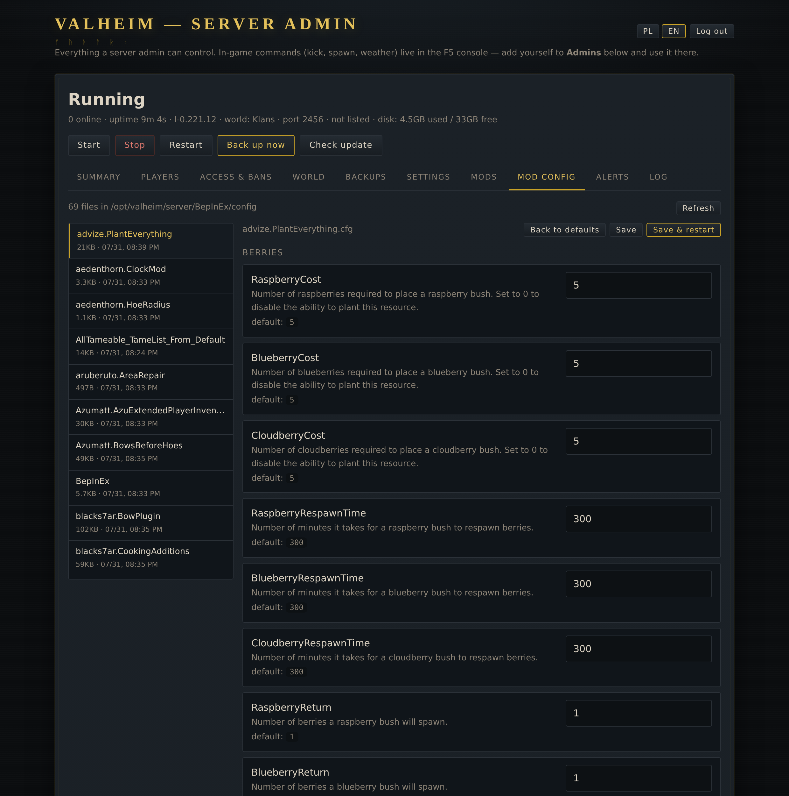
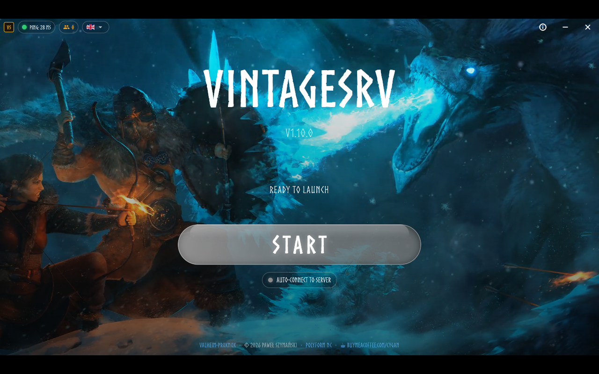

<div align="center">


# valheim-proxmox

**Serwer dedykowany Valheima we własnym LXC, z panelem WWW do zarządzania nim.**

**Gracze dostają launcher na Windows, macOS i Linuksa — z modami serwera działającymi na wszystkich trzech.**

[English →](README.md) · **[Aktualizacja ze starszej wersji](#masz-już-serwer-zaktualizuj-raz--dalej-aktualizuje-się-sam)** · [Zrzuty ekranu](#jak-to-wygląda) · [Panel](#panel) · [Mody](#mody-z-kodu-udostępniania)

[](https://buymeacoffee.com/cygan)

</div>

---

## Masz już serwer? Zaktualizuj raz — dalej aktualizuje się sam

> [!IMPORTANT]
> **Od v1.20.0 panel aktualizuje się sam.** Gdy wyjdzie nowa wersja, pokazuje baner i instaluje
> ją sam, gdy nikt nie gra — najpierw backup świata, a jeśli nowa wersja nie wstanie, wraca
> poprzednia. Można to wyłączyć w Ustawieniach.
>
> **Instalacja sprzed v1.20.0?** Zaktualizuj raz, potem już automatycznie. Świat, ustawienia,
> loginy i mody zostają; gra działa dalej.

**Instalacja z 7 września 2026 lub nowsza** — w Ustawieniach panelu jest przycisk
**Aktualizuj panel**. Kliknij go raz.

**Starsza instalacja albo brak przycisku** — uruchom raz **na hoście Proxmox** (w miejsce `CTID`
numer kontenera, pokaże go `pct list`):

```bash
pct exec CTID -- bash -c "curl -fsSL https://raw.githubusercontent.com/PawelSzymanski89/valheim-proxmox/main/panel/panel-update.sh | bash"
```

Instalacja przez `setup.sh` prosto na Debianie — uruchom tam, jako root:

```bash
curl -fsSL https://raw.githubusercontent.com/PawelSzymanski89/valheim-proxmox/main/panel/panel-update.sh | bash
```

**Docker** — `git pull && docker compose up -d --build` (tam aktualizacją jest obraz).

Na końcu pojawi się `updated to v… - world and settings untouched`. Szczegóły: [Aktualizacje](#aktualizacje).

## Instalacja

Trzy drogi, zależnie od tego, na czym instalujesz. Wszystkie kończą się tym samym:
serwerem gry, panelem, timerami backupu i aktualizacji.

### Na hoście Proxmox VE — sam tworzy kontener

Uruchom jako root **na hoście Proxmoxa**. Buduje nieuprzywilejowany kontener LXC z
Debianem, instaluje w nim wszystko i wypisuje adres, login oraz hasło do gry.

```bash
bash -c "$(curl -fsSL https://raw.githubusercontent.com/PawelSzymanski89/valheim-proxmox/main/install.sh)"
```

Kontener dostaje własne reguły firewalla Proxmoxa: porty gry (UDP) otwarte dla wszystkich,
panel tylko z sieci prywatnych (LAN i zakresy CGNAT, np. Tailscale), cała reszta blokowana —
także port RCON narzędzi admina, który słucha na każdym interfejsie i nie ma opcji, żeby to
zmienić. Reguły działają tylko przy włączonym firewallu Proxmoxa na poziomie Datacenter;
instalator powie, jeśli jest wyłączony. `--no-firewall` je pomija.
```bash
# na hoście Proxmox, dla istniejącego kontenera (CTID = jego numer; porty jak przy instalacji)
cat > /etc/pve/firewall/CTID.fw <<'FW'
[OPTIONS]
enable: 1
policy_in: DROP
dhcp: 1
ndp: 1

[RULES]
IN ACCEPT -p udp -dport 2456:2458 -log nolog
IN ACCEPT -p tcp -dport 2460 -source 10.0.0.0/8,172.16.0.0/12,192.168.0.0/16,100.64.0.0/10 -log nolog
IN Ping(ACCEPT) -log nolog
FW
pct set CTID --net0 "$(pct config CTID | sed -n 's/^net0: //p'),firewall=1"
```

Domyślnie: 4 rdzenie, 6 GB RAM, 30 GB dysku, DHCP. Każdą wartość zmienisz flagą —
`--ram 12288 --disk 40 --ip 192.168.1.50/24 --gw 192.168.1.1`, a `--help` wypisze resztę.

### Na dowolnym Debianie 12/13 — instaluje w systemie, na którym stoisz

Bez Proxmoxa, bez kontenera: VPS, wolny komputer, LXC, który już masz. Uruchom jako
root **wewnątrz tego systemu**.

```bash
curl -fsSL https://raw.githubusercontent.com/PawelSzymanski89/valheim-proxmox/main/setup.sh -o setup.sh && bash setup.sh
```

Te same zmienne środowiskowe co flagi wyżej (`RAM=` i `DISK=` tu nie mają zastosowania —
maszyna jest tym, czym już jest).

### Docker — na dowolnym Linuksie, który już ma Dockera

Jeden kontener z systemd w środku, więc panel działa dokładnie jak na pozostałych dwóch
drogach. Gra pobiera się ze Steama przy pierwszym starcie; porty, nazwy i hasła pochodzą
z `.env` i są czytane raz — potem rządzi nimi panel.

```bash
git clone https://github.com/PawelSzymanski89/valheim-proxmox && cd valheim-proxmox/docker
cp .env.example .env    # opcjonalnie
docker compose up -d --build
```

Sieć hosta: `GAME_PORT` (udp, plus kolejny) i `PANEL_PORT` (tcp) to porty w środku i na
zewnątrz, bez mapowania. Szczegóły, goła forma `docker run` i czego to wymaga
(`privileged`) są w [docker/README.md](docker/README.md). Nie dla Docker Desktop na
macOS/Windows.

Tak czy inaczej trwa to kilka minut, większość to ~1,5 GB pobierane ze Steama. Potem
panel stoi pod **http://ADRES:2460**, login `admin` i hasło wypisane przez instalator na końcu —
wylosowane dla tej instalacji.

---

## Strona publiczna

Adres logowania to jedyna strona, którą obcy w ogóle zobaczą, więc jest zarazem **stroną
statusu**: czy serwer działa, od kiedy, ilu gra i jak wejść — a obok formularz logowania.

Jest **celowo minimalna**. Każde pole jest wyłączone, dopóki go nie włączysz w
**Ustawieniach → Strona publiczna**, bo to widzi cały internet: numer wersji zawęża listę rzeczy
do wypróbowania przeciw serwerowi, a lista modów i wykres obciążenia mówią obcemu, co tam chodzi
i kiedy nikt nie patrzy. Do włączenia: liczba graczy, ich nicki, parametry maszyny z odczytem CPU i pamięci na żywo, lista modów z kodem udostępniania
(wygodne — gracz ma wszystko, zanim zapyta), wykresy obciążenia, wersja serwera, port i to, czy
potrzebne jest hasło. Plus własne zdanie, np. o której serwer się restartuje.

**Hasło do gry nie pojawia się przy żadnym ustawieniu.** Ani nic innego, co panel wie: dysk, logi,
testy i ustawienia siedzą za logowaniem, a `/api/public` to jedyna trasa odpowiadająca bez niego.

Przy dużym zestawie strona układa się inaczej: status i logowanie dzielą górny rząd, lista modów
zajmuje całą szerokość jako siatka kafelków z wyszukiwarką, a wykresy idą pod spód. Siedemdziesiąt
dwa mody w wąskiej kolumnie obok pustego miejsca to była pierwsza wersja i tak właśnie wyglądała.


## Jak to wygląda

Panel ma własną mroczną nordycką skórę — kamień, sadza i przygaszone złoto — na ekranie
logowania i w środku. Interfejs po polsku albo angielsku, przełącznik w prawym górnym rogu.

| | |
|---|---|
|  |  |
| **Mody** — wklejasz kod i wybierasz, co zainstalować | **Konfiguracja** — formularz z metadanych samego pliku |


**Podsumowanie** — adresy do wklejenia z przyciskiem kopiowania, żywe obciążenie kontenera
i testy, które mówią wprost, czego dowodzą. Adresy i sekrety na tych zrzutach maskuje sam
panel: otwierasz go z `?demo=1` i każde IP, hasło, kod dołączenia i kod profilu zamienia się
na wartość przykładową — zrzut nigdy nie wynosi sieci, w której powstał.


**Ustawienia** — nazwa serwera, świat, porty, widoczność, crossplay, preset i modyfikatory
świata oraz logowanie do panelu.

## Co dostajesz

| | |
|---|---|
| **Serwer gry** | Valheim dedicated, systemd z czystym stopem (`SIGINT`, więc świat się zapisuje) |
| **Panel** | WWW na porcie **2460**, autoryzacja HTTP Basic, hasło losowane przy instalacji |
| **Backupy** | kopia świata co 2 h, trzyma 30, przywracanie jednym klikiem |
| **Aktualizacje** | sprawdza Steama co 2 h i restartuje **tylko** gdy jest nowy build |
| **Domyślnie** | 4 rdzenie, 6 GB RAM, 30 GB dysku, kontener wstaje z hostem |

## Panel

| Zakładka | Co daje |
|---|---|
| **Summary** | adresy do wklejenia — z LAN-u i z internetu (z kopiowaniem), żywe obciążenie / RAM / dysk kontenera oraz testy łączności, które mówią wprost, czego dowodzą, a czego nie |
| **Players** | kto gra teraz — nick, identyfikator, **licznik czasu sesji na żywo** — oraz trwała historia logowań (pierwszy raz / ostatnio / ile wejść) |
| **Access & bans** | lista adminów, lista banów, whitelista; ban prosto z listy online albo z historii. **Niepusta whitelista wpuszcza wyłącznie wpisanych** — to reguła samego Valheima, nie panelu |
| **World** | lista światów, przełączanie aktywnego, pobieranie, kasowanie, wgrywanie świata — folderu świata z Valheima 1.0 albo starej pary `.db` + `.fwl`, którą serwer przekonwertuje |
| **Backups** | przywróć, pobierz, usuń; przełączniki timerów auto-backup i auto-update |
| **Settings** | nazwa serwera, świat, hasło, **port gry**, **port panelu**, widoczność na liście serwerów, crossplay, preset i modyfikatory świata (walka, kara za śmierć, surowce, najazdy, portale) oraz przełączniki (`nobuildcost`, `playerevents`, `passivemobs`, `nomap`) |
| **Mods** | wklejasz **kod udostępniania** z Thunderstore Mod Managera / r2modman: panel go rozwija, pokazuje zawartość i instaluje zaznaczone paczki (BepInEx w komplecie, świat najpierw do kopii). Umie też pojedyncze paczki po nazwie |
| **Log** | zdarzenia serwera, bez szumu keepalive od PlayFaba |

Plus Start / Stop / Restart / Backup teraz / Sprawdź update.

### Logowanie do panelu i odzyskiwanie dostępu

Logujesz się na własnym ekranie panelu, nie w szarym okienku przeglądarki: ciasteczko sesji
podpisane sekretem **i** skrótem aktualnego hasła, więc zmiana hasła kończy wszystkie sesje.
HTTP Basic dalej działa — dla `curl`a i skryptów.

Pierwsze hasło jest losowane dla każdej instalacji i wypisywane na jej końcu (w Dockerze:
`docker compose logs | grep "panel login"`). Do v1.20.1 wszędzie było to `valheim123`;
instalacja, która wciąż je ma, pokazuje czerwony baner, dopóki nie zmienisz go w
**Ustawieniach → Logowanie do panelu** (panel zapyta najpierw o obecne hasło).

Wpisałeś `valheim123` i panel mówi, że zostało wyłączone? Każda instalacja do v1.21.0 startowała
z tym hasłem, a aktualizacja go nie ruszała — więc od v1.22.0 panel przy pierwszym starcie zamienia
je na losowe. Własne ustawiasz tak samo jak po zablokowaniu:

Zablokowałeś się? Nie ma żadnej procedury resetu — ustawiasz nowe hasło z hosta Proxmoxa:

```bash
pct exec <CTID> -- /opt/valheim/panel-passwd.sh 'nowe-haslo-min-8-znakow'
pct exec <CTID> -- /opt/valheim/panel-passwd.sh nowyuser 'nowe-haslo'   # razem z loginem
```

Skrypt zapisuje `/opt/valheim/panel.env` (600, root) i działa od następnego zapytania —
bez restartu. Login możesz też podać przy instalacji: `--panel-user` / `--panel-pass`.

### Porty

| Port | Co |
|---|---|
| `2456-2458/udp` | gra (Valheim zawsze zajmuje trzy kolejne porty od tego, który ustawisz) |
| `2460/tcp` | panel — celowo tuż obok portów gry, żeby się pamiętało, i z dala od zajeżdżonych 8080, 8000, 9000, 8006… |

Oba zmienisz w **Settings**. Zmiana portu panelu restartuje go przez `systemd-run`, żeby
zapytanie, które tę zmianę zleciło, zdążyło dostać odpowiedź. Panel nie pozwoli ustawić
portu, który wpadłby w trzyportowy zakres gry.

## Granie z internetu

Przekieruj na routerze **UDP 2456-2458** na kontener. Tyle wystarczy — Valheim to goły
UDP, nie idzie przez reverse proxy i nie potrzebuje certyfikatu.

### Crossplay zmienia znaczenie słowa „port"

**Zmierzone, nie założone:** przy włączonym crossplayu serwer rozmawia przez relay PlayFaba i
**w ogóle nie otwiera portu gry** — `ss -uln` pokazuje wyłącznie port zapytań. Gracze wchodzą
z listy crossplay przez kod dołączenia, a przekierowanie portów na routerze nie robi nic.

Przy wyłączonym crossplayu serwer nasłuchuje na `2456` i wchodzi się po adresie — i po to
właśnie jest forward opisany wyżej. Dlatego instalator zostawia crossplay **wyłączony**;
włączysz go w Settings, jeśli wolisz graczy z Xboxa/Game Passa zamiast wejścia po adresie.
**Crossplay wymaga `libpulse-mainloop-glib0`.** Bez tego PlayFab Party nigdy się nie
inicjalizuje, log co 30 s powtarza `begin PlayFab create and join network`, a kod dołączenia
wychodzi pusty — czyli serwer, do którego nikt nie wejdzie żadną drogą. Instalator ją dokłada;
diagnoza to `ldd libparty.so`. Przy działającym crossplayu panel wyciąga **kod dołączenia**
z logu i pokazuje go na Summary (zmienia się przy każdym restarcie).

**Panelu nie wystawiaj na świat.** Umie kasować światy i wydawać je do pobrania. Tylko
LAN albo VPN. Jeśli musisz — schowaj go za reverse proxy z własną autoryzacją.

## Mody z kodu udostępniania

Wyeksportuj profil w Thunderstore Mod Managerze albo r2modmanie (**Settings → Export profile →
as a code**) i wklej kod w zakładce **Mods**. Panel ściąga profil z Thunderstore, wypisuje
paczki z dokładnymi wersjami i instaluje te, które zostawisz zaznaczone — razem z BepInEx-em,
jeśli go jeszcze nie ma.

Po co przez kod, a nie klikając mody z listy: wersje w kodzie to dokładnie te, które mają już
Twoi gracze, a to niezgodność wersji odbija ludzi przy wejściu. Kod jest potem widoczny na
zakładce **Summary**, więc możesz go oddać każdemu, kto ma się dostroić.

Profile zawierają też mody czysto klienckie (UI, mapy, dźwięki). Na serwerze zwykle nie
przeszkadzają, ale kilka potrafi rzucić wyjątkiem, więc odznacz to, czego serwer nie
potrzebuje. Przed pierwszym modem świat trafia do kopii — mody potrafią popsuć zapis
nieodwracalnie.

Instalacja najpierw **zatrzymuje serwer**, a po wgraniu podnosi go z powrotem — pisanie do
`BepInEx/plugins` pod działającym serwerem zostawia stare assembly w pamięci i wygląda
dokładnie jak „mod się nie zainstalował".

**Usuń wszystkie mody** wrzuca świat do kopii, zatrzymuje serwer, kasuje BepInEx i wszystkie
pluginy, a potem pyta, czy podnieść go czystego, czy zostawić wyłączony, żebyś wgrał inny
zestaw. Plik świata zostaje nietknięty, ale to, co mod do niego dodał, przestaje istnieć.

Zainstalowane mody leżą w `server/BepInEx/plugins/<autor>-<Paczka>/`, a `start.sh` sam włącza
loader doorstop, gdy tylko pojawi się katalog `BepInEx/`.

### Trzymanie wersji w jednej linii

**Sprawdź aktualizacje** pyta Thunderstore o najnowszą wersję każdej zainstalowanej paczki i
zaznacza to, co zostało w tyle. **Zaktualizuj wszystkie** bierze tylko te, zatrzymuje serwer,
aktualizuje i podnosi go z powrotem.

**Przypnij** paczkę, a nigdy więcej nie zostanie zaproponowana — bo liczą się te wersje, które
mają Twoi gracze, a serwer, który po cichu ucieka do przodu, odbija wszystkich przy wejściu.
Przypięte paczki odrzuca samo wywołanie aktualizacji, nie tylko interfejs.

**Zrób kod udostępniania** zamienia to, co stoi na serwerze, w profil Thunderstore i oddaje jeden
kod. Gracze wklejają go w swoim managerze i mają dokładnie te wersje — ten sam mechanizm co import,
tylko w drugą stronę.

### Sprawdzone na prawdziwym zestawie 72 modów

Cały przepływ przeszedł na realnym kodzie udostępniania z 72 paczkami („Januszheim"):
podgląd, instalacja, restart, edycja konfiguracji, zapis, restart, przywrócenie.

- **72 zainstalowane, 0 nieudanych**, 1455 MB pobrane z Thunderstore; gra wstała z
  **71 załadowanymi wtyczkami** i doszła do `Game server connected`.
- Proces serwera ustabilizował się na **6,7 GB RSS** z tym zestawem — warto to wiedzieć przed
  wyborem `--ram`. Domyślne 6 GB to liczba dla czystej gry.
- **69 plików konfiguracyjnych** pojawiło się po pierwszym uruchomieniu modów; samo
  `PlantEverything` rozkłada się na **147 pozycji formularza** z opisami, typami i domyślnymi.
- Zapis zmienił **dokładnie jedną linię w pliku mającym 760**, serwer wstał z kompletem wtyczek,
  a poprzednia wersja wróciła jednym kliknięciem.

Ten przebieg wyciągnął dwa błędy w rozpakowywaniu, oba z paczek pakowanych na Windowsie:
ścieżki miały backslashe, więc `plugins\Mod.dll` lądował jako jeden plik z backslashem w nazwie,
a `plugins\Translations\` nie było rozpoznane jako katalog i powstawał z tego pusty **plik**,
przez co każdy prawdziwy plik pod nim się wywracał. Oba przypadki są teraz normalizowane.

## Launcher dla graczy — Windows, macOS i Linux

Mody na serwerze są nic niewarte, jeśli gracze nie potrafią ich sobie wgrać, więc panel wydaje
launcher, który robi to za nich. Dajesz jeden adres — przycisk **Pobierz** na stronie
publicznej albo `/api/launcher/download` — a gracz dostaje paczkę nazwaną Twoim serwerem, **na
swój system**: `.exe` na Windowsie, `.app` na macOS, zwykłą binarkę na Linuksie.

**Mody działają na wszystkich trzech.** Launcher sam znajduje grę (czyta `libraryfolders.vdf`
Steama, więc drugi dysk mu nie przeszkadza), pobiera dokładnie te pliki, które wysyła serwer —
każdy sprawdzony po `sha256` — usuwa to, czego serwer już nie używa, instaluje loader właściwy
dla systemu i uruchamia grę. Na Windowsie loaderem jest `winhttp.dll`, na macOS i Linuksie
`run_bepinex.sh` z `libdoorstop`. **Na Apple Silicon launcher celowo odpala grę przez Rosettę**:
proces arm64 wczytuje loader, ale nigdy nie zahacza Mono, więc mody po cichu nic nie robią —
jedna linijka różnicy między „72 mody działają" a „nie ma modów i nie ma komunikatu błędu".

Sprawdzone na packu z 72 modami: 1,5 GB w 466 plikach, 71 pluginów załadowanych, gra wstaje.



Mody serwerowe zostają na serwerze. Wszystko, co pasuje do RCON-a albo narzędzi admina, jest
domyślnie odznaczone w zakładce **Launcher**, a config z hasłem nigdy nie trafia do manifestu —
to nie teoria, bo config jednego moda niósł kiedyś hasło RCON.

Launcher aktualizuje się sam z wydań na GitHubie i zachowuje przypisanie do serwera przez
aktualizację. Silnik: [valheim_launcher_proxmox](https://github.com/PawelSzymanski89/valheim_launcher_proxmox).

## Konfiguracja modów — bez SSH i bez rozwalania

BepInEx zapisuje po jednym `.cfg` na plugin. Zakładka **Konfiguracja modów** czyta je i buduje
**formularz**: każdy wpis zachowuje swój opis, typ i wartość domyślną z komentarzy w samym
pliku, więc `Boolean` to przełącznik, liczba z zakresem to pole liczbowe z granicami, a wpis z
listą dopuszczalnych wartości to lista rozwijana. Klucze, sekcje i komentarze nie są
przepisywane — zmienia się wyłącznie wartość, w jej własnej linii. Stąd konfiguracji nie da
się rozwalić.

**Każdy zapis zostaje.** Pod formularzem jest lista wcześniejszych wersji; jedno kliknięcie
przywraca dowolną, a stan, który właśnie zastępujesz, też trafia na listę — więc przywracanie
również da się cofnąć. Dwadzieścia wersji na plik.

Mody czytają konfigurację przy starcie, dlatego **Zapisz** i **Zapisz i zrestartuj** to osobne
przyciski.

## Narzędzia tylko dla admina i wiadomości w grze

Czysty Valheim nie daje adminowi żadnej drogi do działającego serwera — bez RCON-a, bez
gniazda konsoli, bez czatu. Trzy mody **po stronie serwera** to zapewniają, a zakładka
**Mods** instaluje i konfiguruje wszystkie trzy jednym przyciskiem:

| Paczka | Do czego służy |
|---|---|
| `AviiNL-rcon` | przenosi protokół RCON |
| `JereKuusela-Rcon_Commands` | stawia za nim konsolę serwera |
| `JereKuusela-Server_devcommands` | komendy warte wysyłania |

**Gracze nie instalują nic.** Te mody działają wyłącznie na serwerze, a czysty klient
dołącza jak wcześniej. Wszystko, co od nich zależy, zostaje ukryte w panelu, dopóki nie odpowiedzą.

RCON włącza się z wylosowanym hasłem na porcie **2465** — celowo nie domyślnym 2458 moda,
bo ten mieści się w zakresie 2456-2458, na który wskazuje forward na routerze. Nasłuchuje
dla panelu na tej samej maszynie — nie ma powodu, żeby go wystawiać, i same powody, żeby tego nie robić.

Z zainstalowanymi modami zakładka **Messages** potrafi:

- wysłać linijkę do wszystkich grających, na środku ekranu albo w rogu,
- trzymać **harmonogram** wiadomości — *N godzin gry przed zmierzchem*, *o danej godzinie
  gry*, albo *co N minut realnego czasu*. Reguła odpala się raz na dobę w grze i nigdy do
  pustego serwera.
- pokazać, co wysłano, kiedy i przez którą regułę.

Lepsze stają się też backupy: z zainstalowanymi narzędziami `backup.sh` prosi serwer o
zapisanie świata, zanim go skopiuje. Bez tego backup jest świeży tylko na tyle, ile ostatni
autosave — do dwudziestu minut w tyle.

### Zegar w grze, bez żadnego moda

Czas gry płynie w tempie zegara ściennego, gdy ktoś jest połączony, i stoi w miejscu, gdy nikogo
nie ma, więc panel wylicza go z pliku świata: dzień, porę dnia i ile zostało do zmiany. Strona
publiczna też to pokazuje. Jedna godzina w grze to 75 sekund realnych, a z trzydziestominutowego
cyklu jasnym dniem jest z grubsza 21 minut.

Czego żadne źródło nie opisuje, to faza — której godzinie zegara odpowiada zero zapisanego
licznika. Panel zakłada 06:00; jeśli w Twoim świecie niebo pokazuje coś innego, przesuwa to
`VH_CLOCK_OFFSET`.

## Alerty na telefon i okno serwisowe

Panel sam ogląda serwer raz na minutę — już nie tylko wtedy, gdy ktoś otworzy stronę — i wypycha
zmiany na **[ntfy](https://ntfy.sh)**: apkę, która nie wymaga konta, logowania ani własnego
serwera.

**Konfiguracja to dwa kroki.** Instalator losuje nieodgadywalną nazwę tematu
(`valheim-a1b2c3d4e5`) i ją wypisuje. Instalujesz ntfy ([Android](https://play.google.com/store/apps/details?id=io.heckel.ntfy) ·
[F-Droid](https://f-droid.org/packages/io.heckel.ntfy/) ·
[iOS](https://apps.apple.com/app/ntfy/id1625396347) · [przeglądarka](https://ntfy.sh/app)),
subskrybujesz tę nazwę i klikasz **Wyślij testowe**. Każdy, kto ma dostawać alerty, subskrybuje ten
sam temat; nazwa jest jedynym sekretem — dlatego jest losowa i jednym kliknięciem generujesz nową,
gdyby wyciekła.

Każdy alert to osobny przełącznik: **serwer padł / wstał**, **gracz wszedł / wyszedł**, **kopia się
nie udała**, **kończy się dysk**, **jest aktualizacja na Steamie**, **ktoś zalogował się do
panelu**, **nie udała się instalacja moda**, **zaplanowany restart**. Własny serwer ntfy też
działa — podajesz adres i token.

Temat i serwer leżą w `panel.env` (600) obok logowania — ten sam podział, co w reszcie tego
homelaba: sekrety w pliku env, „co wysyłać" w `alerts.json`.

**Zaplanowany restart.** Valheim puchnie w pamięci przez kolejne dni, więc nocny restart to
zwykła higiena — ale nie w środku najazdu. Ustawiasz godzinę, zostawiasz **tylko gdy nikt nie
gra**, a jeśli o tej porze ktoś siedzi na serwerze, restart zostaje przełożony i ponowiony
później; w obu przypadkach dostajesz powiadomienie. Aktualizacje gry przechodzą przez tę samą
bramkę: panel sprawdza Steam co dwie godziny i instaluje nowy build tylko wtedy, gdy tryb premiery
na to pozwala i nikt nie gra. Przycisk **Update** robi to samo na żądanie; `valheim-update.timer`
to włącznik części automatycznej.

### Czas gry i pory, w których serwer żyje

Zakładka **Gracze** prowadzi ranking — łączny czas gry, najdłuższa pojedyncza sesja, liczba sesji,
ostatnia obecność — oraz słupek na każdą godzinę doby, pokazujący, kiedy ludzie realnie grają.
Wszystko wychodzi z dziennika sesji, który panel i tak prowadzi, więc na serwerze gry nic
dodatkowego nie chodzi i nikt niczego nie musi instalować.

## Jakość łącza

Dla serwera gry łącze znaczy więcej niż procesor — Valheim chodzi po UDP, więc o odczuciu decydują
opóźnienie i utrata pakietów. Dwa różne koszty, więc dwie różne zasady. **Ping chodzi także wtedy, gdy ludzie grają** — pięć
pakietów przez cztery sekundy, a to właśnie wtedy ten pomiar jest coś wart, bo na *„wczoraj
wieczorem lagowało"* nie ma odpowiedzi, gdy w wykresie jest dziura. **Przepustowość czeka na pusty
serwer**, bo przepycha 200 MB przez to samo łącze, na którym ci ludzie siedzą. Domyślnie co dziesięć minut i co sześć godzin; oba interwały i obie zasady to ustawienia.

Liczby są uczciwe, bo metoda jest uczciwa: **cztery równoległe strumienie, zsumowane**. Zmierzone
na łączu 1000/600: pojedyncze pobranie 25 MB pokazało 551 Mbit/s, a pojedyncza wysyłka 100 MB —
492, bo przy 10 ms większość krótkiego transferu to TLS i rozpędzanie TCP, nie łącze. Cztery
strumienie tej samej wielkości dały **890–923 w dół i 618–637 w górę**, czyli tyle, ile łącze ma.
25 MB na strumień to też praktyczny sufit: Cloudflare powyżej 100 MB odpowiada 403.

Opóźnienie, pobieranie i wysyłanie mają własne wykresy, obok graczy, CPU i pamięci — ten sam
kształt, ta sama strona. Linie przepustowości są z założenia rzadkie: dostają punkt tylko wtedy,
gdy o sześciogodzinnej porze serwer był pusty.

Jeden pomiar przepuszcza około 200 MB. **Zmierz łącze teraz** w panelu robi to na żądanie i odmawia, gdy ktoś gra, dopóki nie potwierdzisz, a zły
wynik (ponad 10 % strat albo powyżej 150 ms) podnosi alert — bo to moment, w którym gracze zaczynają
obwiniać serwer.

### Co panel przechowuje i jak długo

Nic nie rośnie bez sufitu. Każdy plik przycina się sam przy zapisie, więc nie ma crona do
zapomnienia ani niczego do sprzątania ręcznie:

| Plik | Trzyma | Czyli |
|---|---|---|
| `metrics.json` | 1440 punktów | 24 h graczy, CPU i pamięci, po jednym na minutę (~90 KB) |
| `link.json` | 1008 wpisów | tydzień pomiarów opóźnienia i strat co dziesięć minut (~150 KB) |
| `players.json` | 60 sesji na gracza | sumy zostają na zawsze, lista sesji nie |
| `panel.log` | 4000 linii / 2 MB | przycinany po przekroczeniu rozmiaru |
| `BepInEx/config/.history` | 20 wersji na plik | starsze znikają przy kolejnym zapisie |

Test przepustowości nie zostawia po sobie nic poza plikiem tymczasowym, który sam kasuje, a te
200 MB idzie do `/dev/null`.

## Aktualizacje

Każda instalacja aktualizuje się sama. Gdy wychodzi nowe wydanie, na górze panelu pojawia się
baner z linkiem do listy zmian. Przy włączonym **Instaluj nowe wersje automatycznie** (Ustawienia,
domyślnie włączone) panel instaluje je sam, gdy nikt nie gra; przycisk **Aktualizuj teraz** robi to
od razu.

Aktualizacja to `/opt/valheim/panel-update.sh`: pobiera wydanie, robi backup świata i uruchamia
`setup.sh` w trybie upgrade — panel, `start.sh`, `backup.sh`, unity systemd i zależności przechodzą
na nową wersję. Świat, backupy, `server.env`, login do panelu i mody zostają nietknięte, gra nie jest
pobierana od nowa, a zatrzymany serwer zostaje zatrzymany; restartuje się tylko panel. Jeśli nowy panel
nie odpowie w pół minuty, poprzedni wraca sam. Jedna automatyczna próba na wydanie.

Instalacja za stara na przycisk aktualizuje się raz z terminala, a potem już sama:

```bash
# na hoście Proxmox (CTID = numer kontenera)
pct exec CTID -- bash -c "curl -fsSL https://raw.githubusercontent.com/PawelSzymanski89/valheim-proxmox/main/panel/panel-update.sh | bash"
# w kontenerze / na zwykłym Debianie
curl -fsSL https://raw.githubusercontent.com/PawelSzymanski89/valheim-proxmox/main/panel/panel-update.sh | bash
```

Na instalacji Docker baner mówi, żeby przebudować obraz.

Wydanie to podbicie `panel/VERSION`, tag i release na GitHubie — instalacje przechodzą na tag, nigdy
na nieotagowany commit z `main`.

Repozytorium robi świeżą instalację przy każdym pushu: w kontenerze, z pobraniem ze Steama, po której
panel i gra muszą wstać (`.github/workflows/install.yml`).

## Dziennik panelu

Panel zapisuje własny dziennik każdej akcji do `/opt/valheim/panel.log` — instalacje modów
razem z tym, co się nie udało i dlaczego, zapisy konfiguracji z listą zmienionych kluczy,
akcje usług, operacje na światach i kopiach, zmiany logowania (nigdy hasła). Widać go w
zakładce **Log** obok logu serwera gry, z filtrem na mody albo same błędy.

## Opcje

Każdą wartość nadpiszesz zmienną środowiskową:

```bash
CTID=250 RAM=8192 CORES=6 DISK=40 GAME_PORT=2456 PANEL_PORT=2460 \
SERVER_NAME="Klans" WORLD_NAME="Midgard" SERVER_PASS="wpuscmnie42" \
bash -c "$(curl -fsSL .../install.sh)"
```

| Zmienna | Domyślnie | |
|---|---|---|
| `CTID` | pierwszy wolny | numer kontenera |
| `HOSTNAME_` | `valheim` | nazwa hosta kontenera |
| `CORES` / `RAM` / `DISK` | `4` / `6144` / `30` | rdzenie / MB / GB |
| `STORAGE` | pierwszy storage przyjmujący rootfs | gdzie ląduje dysk kontenera |
| `IP` / `GW` | `dhcp` | stały adres zamiast DHCP: `IP=192.168.89.21/24 GW=192.168.89.1` — przydaje się, gdy DNS albo forward już wskazują ten adres |
| `BRIDGE` | `vmbr0` | mostek sieciowy |
| `GAME_PORT` / `PANEL_PORT` | `2456` / `2460` | |
| `SERVER_NAME` / `WORLD_NAME` | `Valheim` / `Dedicated` | |
| `SERVER_PASS` | losowe 10 znaków | hasło do gry (min. 5 znaków i **nie może zawierać** nazwy serwera ani świata — gra to odrzuca) |

### Flagi

Wszystko powyżej działa też jako flaga — czytelniej wygląda w jednolinijkowcu, który się gdzieś zapisuje:

```bash
bash -c "$(curl -fsSL .../install.sh)" -- --ram 12288 --disk 40 --ip 192.168.89.21/24 --gw 192.168.89.1
```

`--help` wypisze listę razem z aktualnymi domyślnymi wartościami.

## Co gdzie leży

```
/opt/valheim/
├── server/            pliki gry (SteamCMD)
├── data/              savedir: worlds_local/, adminlist.txt, bannedlist.txt, permittedlist.txt
├── backups/           world-RRRRMMDD-GGMMSS.tar.gz, trzyma 30
├── server.env         ustawienia startowe — to edytuje panel
├── panel.env          login, hasło i port panelu (600)
├── players.json       historia logowań (journal się rotuje, ten plik nie)
├── start.sh           skleja argumenty startowe z server.env
├── backup.sh          kopia świata + retencja
├── update.sh          zaślepka — aktualizacje gry robi panel (valheim-update.timer = włącznik)
├── panel-update.sh    aktualizacja do najnowszego wydania, z rollbackiem (automatycznie albo przyciskiem)
├── panel.version      zainstalowane wydanie i kiedy
└── panel/             app.py, index.html, .venv
```

systemd: `valheim`, `valheim-panel`, `valheim-backup.timer`, `valheim-update.timer`.

## Czego uczciwie nie da się zrobić

- **Valheim nie ma RCON-a.** Komendy w grze (kick, spawn, pogoda, tryb boga) wpisuje się
  w konsoli F5 jako gracz, którego identyfikator jest w `adminlist.txt`. Panel zarządza tą
  listą — nie napisze za Ciebie w grze. „Kick" to tutaj ban i odbanowanie.
- **Lista graczy online to heurystyka.** Linia z nickiem (`Got character ZDOID from …`)
  nie zawiera identyfikatora gracza, więc nicki dopinane są do połączeń w kolejności
  wejścia. Miarodajny licznik (`Connections N`) pada raz na ~10 minut — gdy oba się
  rozjadą, panel to pokazuje, zamiast ukrywać.
- **Panel chodzi jako root** we własnym kontenerze: woła `systemctl` i pisze po
  `/opt/valheim`. Dlatego to osobny kontener i dlatego nie ma go w internecie.

## Na czym sprawdzone

Proxmox VE 8.4, szablon `debian-12-standard`, Valheim dedicated `l-0.221.12`.
Każda akcja panelu przeszła test na prawdziwym kontenerze: propagacja ustawień aż do
argumentów działającego procesu, przełączanie/wgrywanie/kasowanie światów, przywracanie
kopii (suma kontrolna zgodna przed i po), timery, zmiana portu panelu, zmiana logowania.
Listę graczy i historię pokrywa `panel/test_parse.py`, bo wymagają realnych wejść na serwer.

## Gdy pamięć ucieka

Serwer Valheima rośnie o kilkaset megabajtów na godzinę, nawet gdy nikt nie gra — Unity nie
oddaje pamięci z powrotem — więc długo żyjący serwer dryfuje w stronę OOM killera. Nocne okno
serwisowe zwykle to załatwia, ale serwer zajęty każdego wieczoru wciąż by to odkładał, i po to
jest strażnik pamięci.

Próg jest **liczony, nie stały**, bo to, ile serwer zużywa w spoczynku, zależy niemal wyłącznie
od listy modów: ten stoi koło 12% na czysto i 41% z siedemdziesięcioma dwoma modami, osiągane w
cztery minuty od startu. Jedna liczba albo pętliłaby się na moddowanej instalacji, albo nigdy nie
odpaliłaby na czystej. Więc to **baza plus dodatek za każdy zainstalowany mod** — domyślnie 45% +
0,5% za każdy, oba edytowalne w Settings, co daje 81% dla serwera z 72 modami.

Trzy hamulce, wszystkie wyniesione z wcześniejszych pomyłek: wyłącznie **pusty** serwer, tylko
taki, który stoi **ponad dwie godziny**, i **co najwyżej raz na trzy** — z tym odstępem trzymanym
na dysku, więc restart panelu po cichu go nie zeruje. Każde zadziałanie wysyła powiadomienie z
odczytem, progiem i tym, jak długo serwer stał.

## Licencja

**MIT** — patrz [LICENSE](LICENSE). Używaj, zmieniaj, stawiaj dla znajomych albo za
pieniądze; zostaw notkę o prawach autorskich. Podpisane wydania launchera i wsparcie
na życzenie: **pawel@howtodev.it**.
